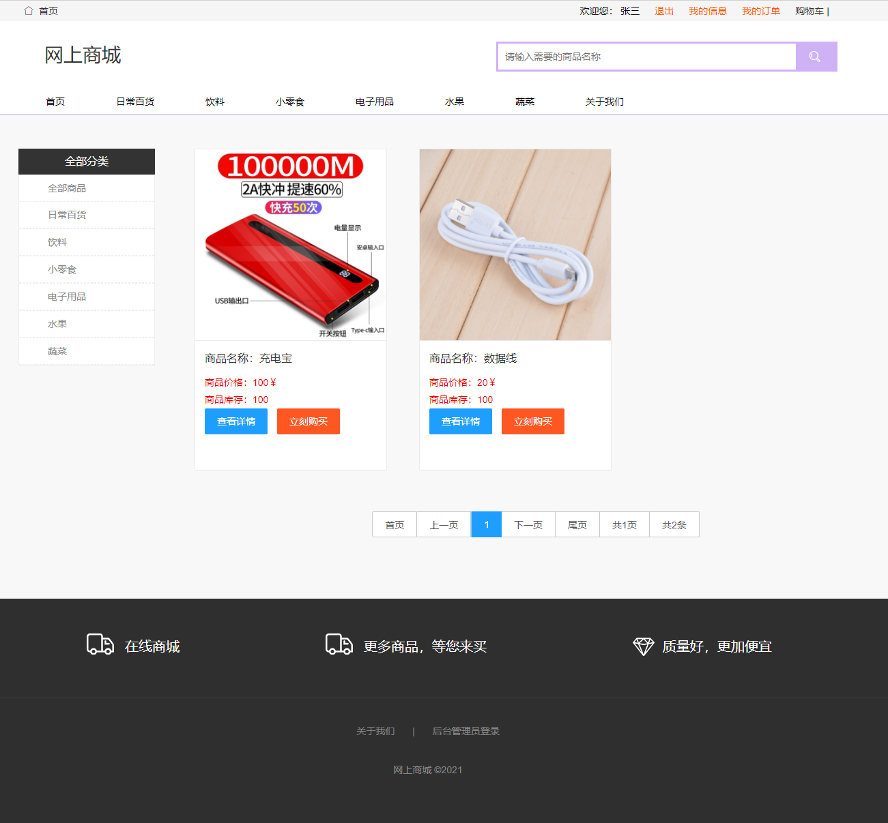
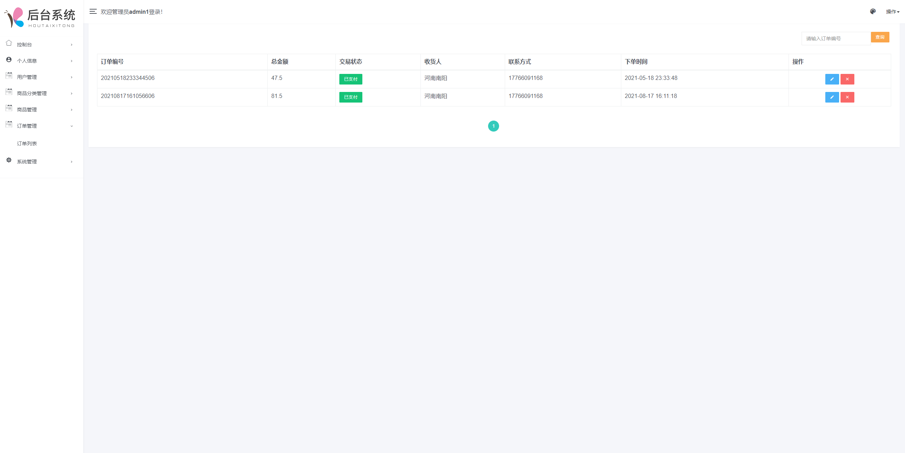
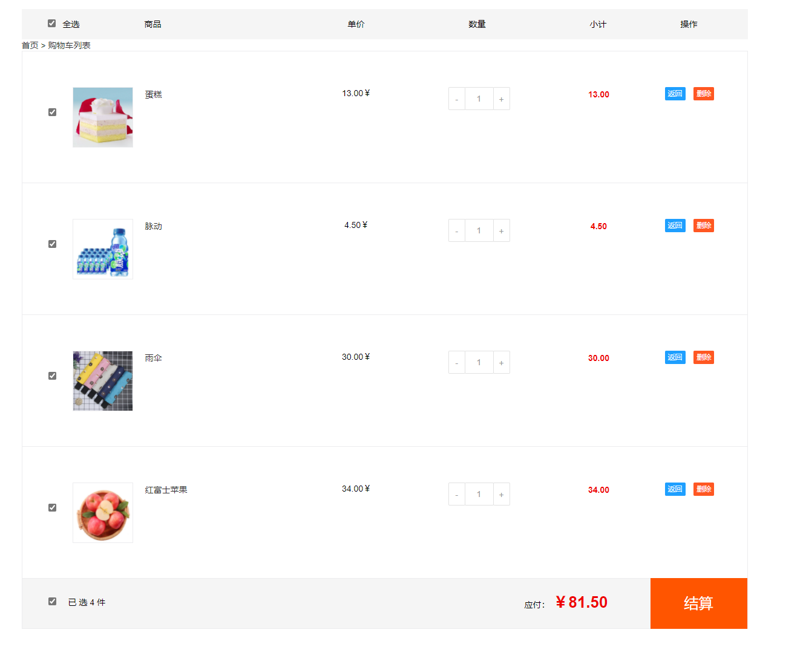
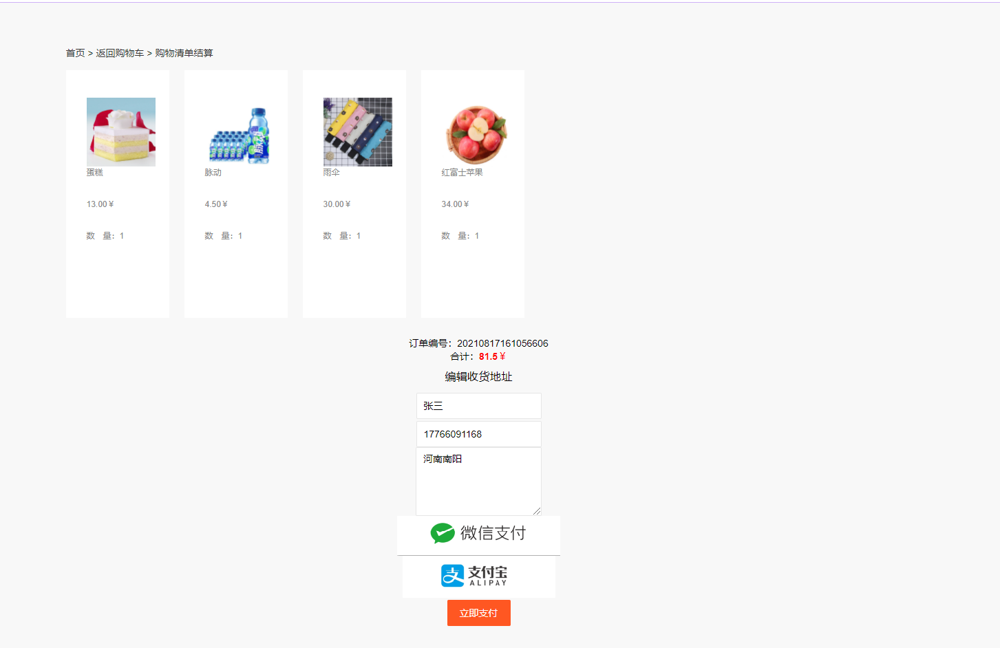
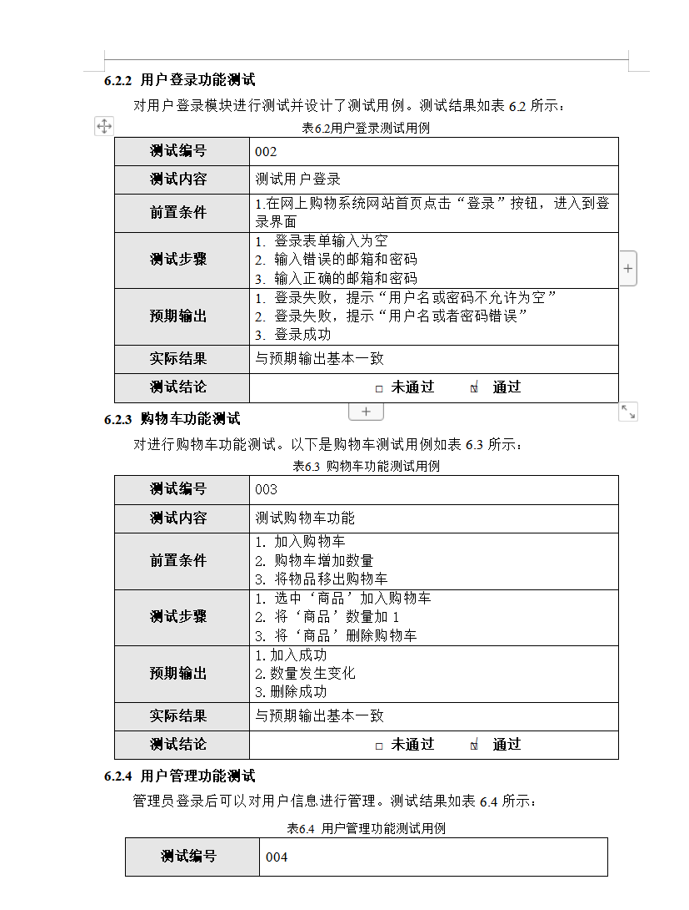
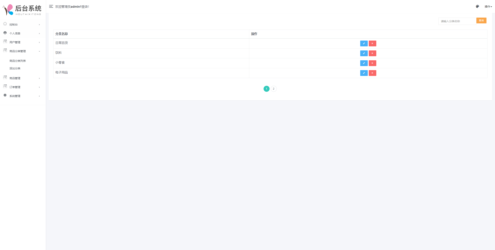
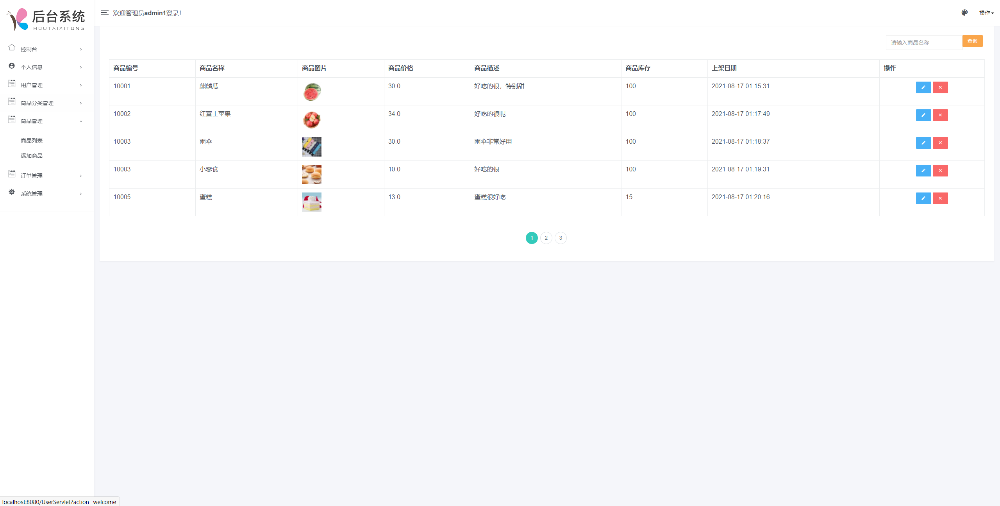

<h1 align="center">基于JSP+Servlet实现的网上商城系统</h1>

 获取sql文件 QQ: 605739993 QQ群: 377586148 

<b> 需要视频演示可联系上述QQ，私发视频链接 </b>

 [个人站点: 从戎源码网](https://armycodes.com/)

## 简介

> 本代码来源于网络,仅供学习参考使用!
>
> 提供1.远程部署/2.修改代码/3.设计文档指导/4.框架代码讲解等服务
>
> 前端地址：http://localhost:8080/student-web/login.jsp
>
> 管理员: admin@qq.com 密码: admin
>
> 用户登录地址：http://localhost:8080/photoalbum/
> 
> 用户：test@qq.com 密码: 123

## 项目介绍

基于JSP+Servlet实现的网上商城系统，主要功能如下：

登录系统后台：通过输入用户名和密码，管理员可以登录系统后台进行管理操作。
**【管理员】**
商品管理：管理员可以添加、修改、删除商品信息，包括商品的名称、价格、库存、描述等。
订单管理：管理员可以查看用户的订单信息，包括订单的状态、商品数量、总金额等，并可以进行订单的处理，如确认付款、发货、退款等。
用户管理：管理员可以查看用户的信息，包括用户名、联系方式、收货地址等，并可以对用户进行管理，如禁用用户、重置用户密码等。
数据统计：管理员可以查看商城的销售数据、用户活跃度等统计信息，帮助商城运营和决策。
网站设置：管理员可以对商城的基本设置进行调整，如网站名称、Logo、客服电话等。

**【用户】**
注册登录：用户可以通过注册账号的方式成为商城的会员，注册后可以使用账号密码登录系统。
商品浏览：用户可以浏览商城的商品，包括浏览商品分类、搜索商品、查看商品详情等。
购物车管理：用户可以将感兴趣的商品添加到购物车中，可以修改购物车的商品数量、删除商品等。
下订单：用户可以在选定商品后生成订单，包括选择商品规格、填写收货地址等。
在线支付：用户可以选择在线支付方式进行支付，如支付宝、微信支付等。
订单管理：用户可以查看自己的订单信息，包括订单状态、商品数量、总金额等，并可以进行一些操作，如取消订单、确认收货等。
评价商品：用户可以对购买的商品进行评价，并给出相应的评分和评论。

## 环境

- <b>IntelliJ IDEA 2020.3</b>

- <b>Mysql 5.7.26</b>

- <b>Tomcat 8.0.32</b>

- <b>JDK 1.8</b>

## 运行截图

